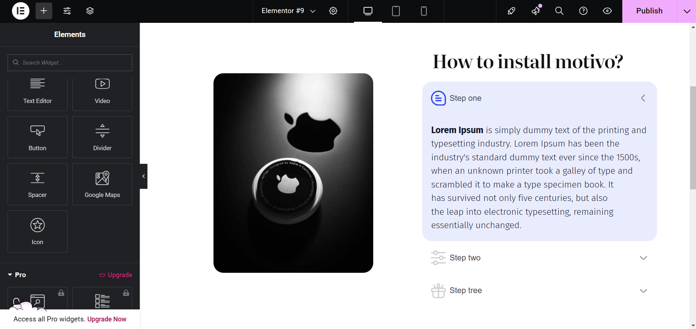

# Motivo Accordion Widget for Elementor 🚀

## ✨ Overview
**Motivo Accordion Widget** is a custom Elementor widget that allows you to create an interactive **image-synced accordion**. When users click on accordion tabs, the displayed image updates dynamically.

This plugin was developed for a client on [Motivo.one](https://motivo.one).

## 📌 Features

✔️ Elementor Widget  
✔️ Accordion with Image Sync  
✔️ Fully Customizable  
✔️ Lightweight and Optimized  
✔️ Works with WordPress 6.0+

## 🔧 Installation

### From WordPress Dashboard
1. Navigate to **Plugins > Add New**.
2. Click **Upload Plugin** and select the `.zip` file.
3. Click **Install Now**, then **Activate** the plugin.

### Manual Installation
1. Extract the plugin files into the `/wp-content/plugins/motivo-plugin` directory.
2. Activate the plugin through the **Plugins** menu in WordPress.

## 🚀 Usage

1. Open the **Elementor Editor**.
2. Drag and drop the **Motivo Accordion** Widget.
3. Configure accordion content and images.
4. Save and preview the changes.

## 🎯 Requirements

- WordPress 6.0+
- PHP 7.4+
- Elementor Page Builder

## 🛠️ Development & Customization

If you need custom modifications, feel free to fork this repository or contact us.

## 📜 License

This plugin is licensed under the **MIT License**. You are free to modify and distribute it under the same license.

## 📧 Support

For issues and feature requests, you can open a ticket on GitHub. 

---

🔹 *Developed with ❤️ for Motivo.one*

